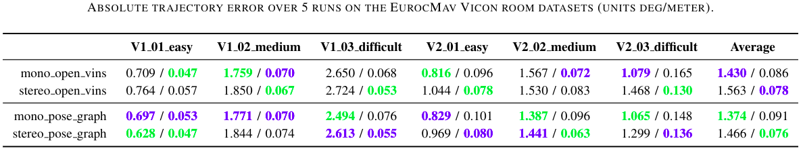
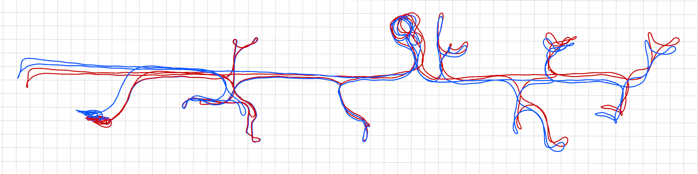
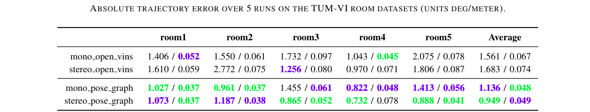

# OpenVINS Secondary Pose Graph Example


This is an example secondary thread which provides loop closure in a loosely coupled manner for [OpenVINS](https://github.com/rpng/open_vins).
This code was originally developed by the HKUST aerial robotics group and can be found in the [VINS-Fusion](https://github.com/HKUST-Aerial-Robotics/VINS-Fusion) repository.
Here we stress that this is a loosely coupled method, thus no information is returned to the estimator to improve the underlying OpenVINS odometry.
This codebase has been modified in a few key areas including: exposing more loop closure parameters, subscribing to camera intrinsics, simplifying configuration such that only topics need to be supplied, and some tweaks to the loop closure detection to improve frequency.
Please see the below sections on the dependencies of the system along with a discussion of how the loop closure logic works, its improvements, and limitations.


## Codebase Disclaimer

This code is provided, as is, and is an example of how to use a secondary thread with the OpenVINS system.
Thus, this code has been directly adapted from the [VINS-Fusion](https://github.com/HKUST-Aerial-Robotics/VINS-Fusion) repository without a thorough investigation of the underlying code.
Therefore we don't have any guarantee of the accuracy or correctness.
Additionally, for questions about the underlying implementation (besides discussing the changes introduced from the original codebase) we might not be able to answer in detail.


## Dependencies

* OpenVINS - https://docs.openvins.com/gs-installing.html
* Ceres Solver - https://github.com/ceres-solver/ceres-solver


## Installation Commands


```
# setup our workspace
mkdir -p catkin_ws_ov/src/
cd catkin_ws_ov
catkin init
# repositories to clone
cd src
git clone https://github.com/rpng/open_vins.git
git clone https://github.com/rpng/ov_secondary.git
# go back to root and build
cd ..
catkin build -j4
# run the OpenVINS system and loop node
source devel/setup.bash
roslaunch ov_msckf pgeneva_ros_eth.launch
roslaunch loop_fusion posegraph.launch
```


## Example Results / Discussion

We found that while the secondary pose graph works well in some cases, in many other cases it fails to improve performance or even hurt it.
For example on the EurocMav dataset there isn't a clear winner in terms of ATE accuracy of the OpenVINS odometry poses being fed into the loop closure module and its published states.
On these small room datasets, many loop closure candidates are rejected, and thus there are maybe 2-4 loop closures, with V1\_02\_medium dataset having none over the whole trajectory in most cases.
Also to ensure there are enough points for PnP, the number of tracked features in ov\_msckf needed to be increased to around 300.




On the other hand, there are cases where the loop closure clearly helps.
For example, on a long dataset such as the corridor1 from the [TUM-VI](https://vision.in.tum.de/data/datasets/visual-inertial-dataset) dataset the system running in monocular mode drifts towards the end of the dataset (blue).
The loop closure (red) is able to correct this and ensure that the ending pose is correct relative to the start (the sensor system returns to the same location in the bottom left of this trajectory).




Looking at some more quantitative results on the TUM-VI dataset, a few runs on the room datasets can clearly show the advantage of loop closure.
These room datasets are limits to the same vicon room environment, and get very frequent loop closures due to this.
From the below table, it is very clear that using the secondary loop closure thread in most cases has a clear performance gain as compared to the standard odometry.




## How VINS-Fusion Loop Closure Works


1. We first wait to ensure we have received an initial camera intrinsic and camera to IMU extrinsic message.
	- Both of these values will change over time if OpenVINS estimate them online
	- Thus we will subscribe to updates to get the latest calibration
2. In `pose_graph_node.cpp` we get an image, pointcloud, odometry messages from the OpenVINS system.
	- Our pointcloud is special and contains all 3d features (in the global frame) seen from the image
	- Additionally, it has in its channels the raw uv coordinates, normalized coordinates, and feature id for all features
	- In this case, our image/pointcloud/odometry will all be of the last marginalized clone in OpenVINS
3. Add the keyframe to our pose graph
	- This is only done if we have moved enough (typically a few centimeters to remove stationary cases)
	- Additionally, one can "skip" every few frames so the pose graph has less keyframes
4. Preprocess information of the keyframe
	- We will store all the global 3d position of features and their corresponding uvs
	- Additionally, more features are extracted to help with bag-of-word frame retrieval
	- These are called `window_keypoints` and `keypoints` respectively
	- Brief descriptors are extracted for all features
5. Trying to detect a loop closure
	- In `pose_graph.cpp` the `addKeyFrame()` function will call on `detectLoop()` to try to find a keyframe
	- This will query a [DBoW2](https://github.com/dorian3d/DBoW2) database with all past keyframes in it
	- From the top *n* returned matches, we select the oldest one that passes all our thresholds
	- This oldest will have the smallest id, and will need to be able to get a valid PnP pose calculated
6. Pose graph optimization
	- If we have found a keyframe match, then we should optimize our graph
	- The keyframe with a loop closure gets appended to `optimize_buf` and will be read by the `optimize4DoF()` thread
	- Append all keyframes as parameters
	- If a keyframe has a loop closure, thenappend that as an edge
	- Always append the relative between the last frame and the current frame (based on OpenVINS odometry)
	- After optimizing calculate how much the new keyframe should be "corrected" (e.g. `yaw_drift,r_drift,t_drift`)
7. Publish the current IMU pose as odometry
	- It is important to note that the pose graph always "lags" behind the estimate
	- The current state is rotated into the last added keyframe
	- Then the "correction" to that original keyframe is applied to the state
	- The corrected pose is then re-published (see `vio_callback()` function)


## Identified Limitations

* The graph has constant weighting, and thus a single bad loop closure can corrupt the whole estimate
* Keyframes can only be loop closed to once, thus a keyframe can't be continuously loop closed too
* Bag-of-word lookups can fail if not exactly near the same perspective
* How best to quantify that we have a good PnP result from RANSAC?
* Features that are used are never improved, nor optimized again, they are taken to be "true"
* Tuning the system is difficult and can hurt performance if not properly tuned


